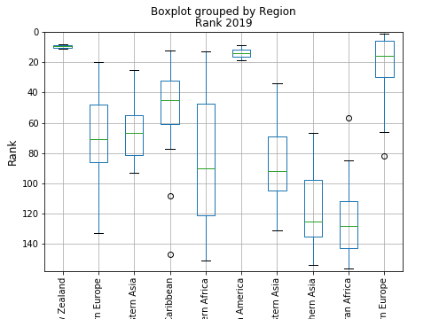

# The Pursuit of Happiness Factors
Team Happy - Paul Dean, Soo Bin Hwang, Mark Gatongay, Seunghwa Jun

## Overview
Since 2012, Gallup publishes [World Happiness Report](https://worldhappiness.report/ed/2019/) every year in which it ranks countries by how happy people around the world perceive themselves to be. By using the findings from this report, a correlation analysis on the level of happiness among participating countries was conducted to identify the following:

* Correlation studies among 11 factors that may have contributed to the happiness ranks
* Trends in the happiness ranking by the geographical location
* The top two most contributing factors to happiness

The programming was primarily written in Python which utilized the following libraries:

* Pandas
* Matplotlib
* SciPy
* Numpy

For a deeper understanding, refer to the official report by clicking [here](https://github.com/soobing91/P1_World_Happiness_Report/blob/master/20190715%20TeamHappy%20PPT%20Final.pdf).
